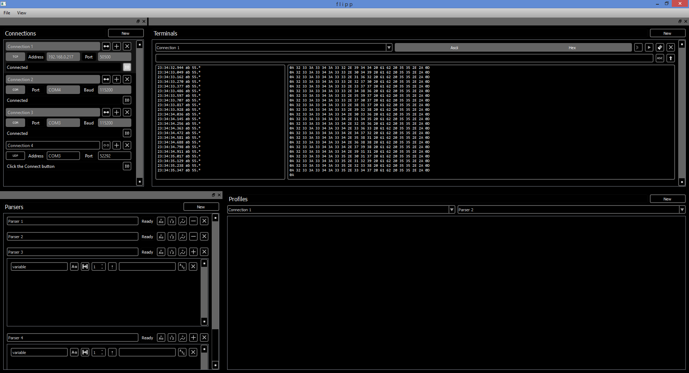

flipp
==========

##Flexible Integrated Parser and Plotter

This program will provide an interface to do the following:

1. Connect to a TCP, UDP, or serial data stream.
2. Build a set of variables to look for in the stream.
3. Plot the values found in the stream in real time.
